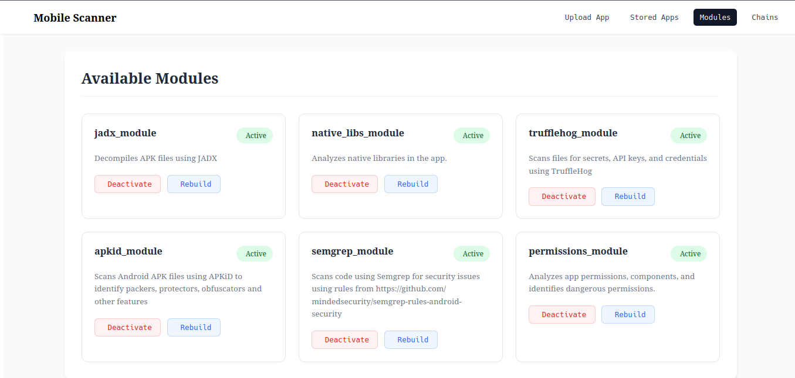

# Mobile Security Testing Platform

A comprehensive platform for analyzing and security testing mobile applications. This project aims to create a modular alternative to [MobSF](https://github.com/MobSF/Mobile-Security-Framework-MobSF/) with easier customization and extensibility.


> [!WARNING]  
> This project is in active development and has not been thoroughly tested. Use at your own risk.

## Features

### Module System
- Pluggable architecture with independent analysis modules
- Real-time module status monitoring
- Support for [custom module implementations](https://github.com/Stormtrooperroman/MobSec/blob/master/docs/write_module.md)

## Getting Started

### Requirements
- Docker is required. To install docker, please follow these [instructions](https://docs.docker.com/get-started/get-docker/).

### Installation

1. Clone the repository:

```bash
git clone https://github.com/Stormtrooperroman/MobSec.git
```

2. Run docker compose:

```bash
cd MobSec
docker compose up -d --build
``` 

3. Open the web interface in your browser:

```bash
http://127.0.0.1/
```

SwaggerUI is available at:
```bash
http://127.0.0.1:8000/docs
```

## Interface





